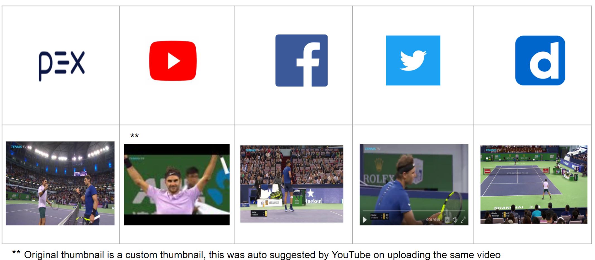

# Auto selection of thumbnails for videos.

**A thumbnail worth a thousand frames**

Deep Neural Network - Automatic selection of the most optimal and relevant Thumbnails for Videos.

This repo provides the package that can select top 3 most **optimal and most relevant thumbnails** for any given video. Here are a few example outputs:

